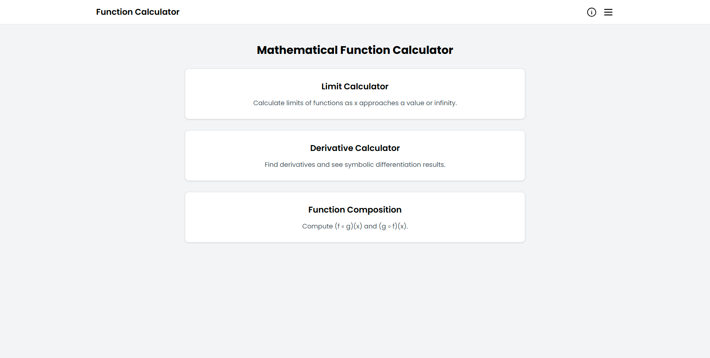

# Function Calculator

A simple and interactive Python Flask web application for solving mathematical functions, including Limits, Derivatives, and Function Composition (f(g(x))).


---

## ✨ Features

- **Limit Calculator**
  Calculate limits as x approaches a value or infinity.

- **Derivative Calculator**
  Compute first-order derivatives of functions.

- **Function Composition Calculator**
  Evaluate composite functions like f(g(x)).

- Web-based interface using **Flask**
- Symbolic math powered by **SymPy**
- Clean and simple UI

---

## 🛠️ Tech Stack

- Python
- Flask
- SymPy
- HTML / CSS / JavaScript

---

## ⚡ Installation & Run

1. Clone repository
   ```bash
   git clone https://github.com/raffyhidayatulloh/function-calculator.git
   ```

2. Enter project folder
   ```bash
   cd function-calculator
   ```

3. Install dependencies
   ```bash
   pip install flask sympy
   ```

4. Run the application
   ```bash
   python app.py
   ```

5. Open browser and visit
   ```bash
   http://127.0.0.1:5000
   ```

---

## 📂 Pages Available

- /limit       : Limit Calculator
- /derivative  : Derivative Calculator
- /composition : Function Composition Calculator

---

## 🧪 Example Inputs

Limit:
```bash
sqrt(x**2+7), x -> 2
```

Derivative:
```bash
x**3+2x
```

Function Composition:
```bash
f(x) = 2x+1
g(x) = x-3
```

---

## 📌 Purpose

This project is intended for:
- Learning calculus concepts
- Practicing Flask web development
- Educational demonstrations

---

### ⭐ If you find this project useful, feel free to share or improve it.

---

## 📸 Screenshots


